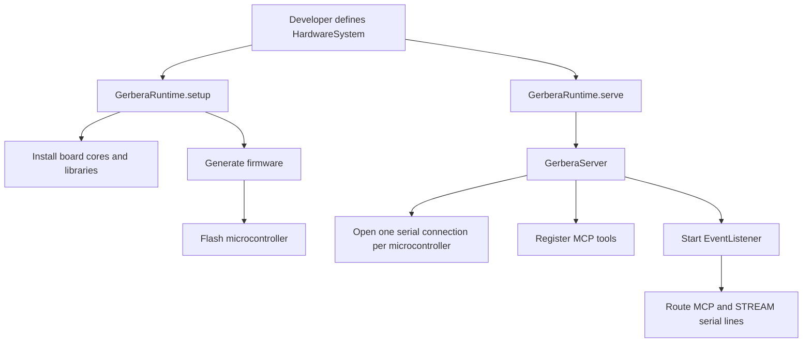
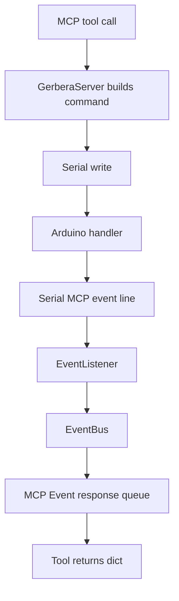
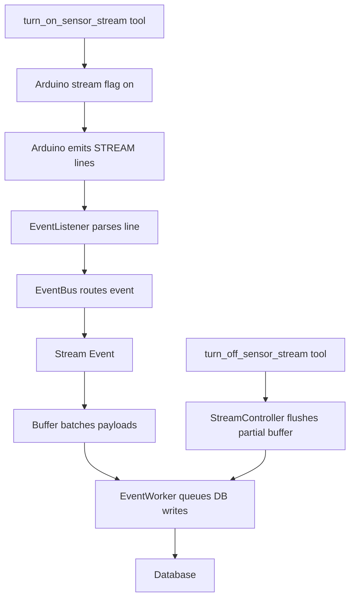

# Gerbera

Gerbera is a Python SDK and local CLI for turning declared hardware into:

- generated Arduino firmware
- flashed microcontroller sketches
- runtime MCP tools
- serial event ingestion
- optional database-backed sensor streams

The main idea is simple: the developer declares the hardware once, and Gerbera uses that model to generate firmware and runtime tools.

## Project Layout

```text
src/gerbera_cli/        Local CLI helpers for board/device setup.
src/gerbera_sdk/        SDK runtime, models, firmware generation, events, server.
rulebooks/              Human and agent guidance for adding devices safely.
tests/                  Unit tests for builders, models, server behavior, events.
example_hardware_system.py
config.json             Local app config with `devices` and `entry_point`.
```

## Runtime Flow



## One-off Tool Flow



Example wire output:

```text
MCP,led_8e910dfb_f928a260,state:on
```

## Streaming Flow



Example wire output:

```text
STREAM,hw201_8e910dfb_e8f75c2b,value:1
```

## Core Domain Rules

- `HardwareSystem` owns microcontrollers.
- `Microcontroller` owns connections.
- `Connection` is one callable hardware capability.
- `component_type` selects a firmware device builder.
- `description` is human-facing and can be long.
- `event_name` is internal, deterministic, hash-based, and Postgres-safe.
- Database streaming is explicit per connection.
- Device builders must opt into database compatibility with `supports_database = True`.

## Identifier Strategy

Runtime event names and table names use:

```text
<component_type>_<short_microcontroller_hash>_<short_connection_hash>
```

This keeps names:

- stable across runs
- short enough for PostgreSQL identifiers
- safe from arbitrary long user descriptions or connection names

## Important Docs

- [SDK Overview](src/gerbera_sdk/README.md)
- [Contracts](src/gerbera_sdk/contracts/README.md)
- [Models](src/gerbera_sdk/models/README.md)
- [Firmware](src/gerbera_sdk/firmware/README.md)
- [Device Builders](src/gerbera_sdk/firmware/devices/README.md)
- [Events](src/gerbera_sdk/events/README.md)
- [Server](src/gerbera_sdk/server/README.md)
- [CLI](src/gerbera_cli/README.md)
