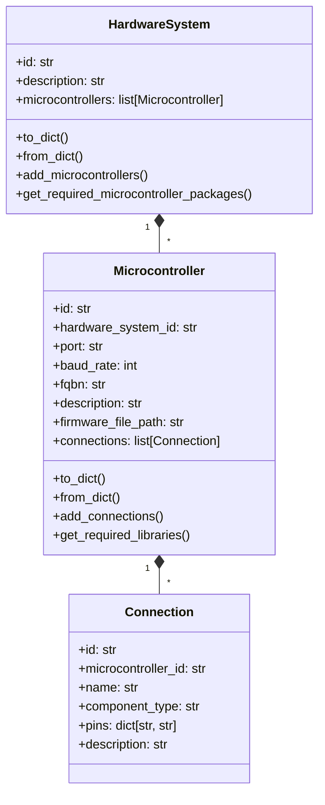
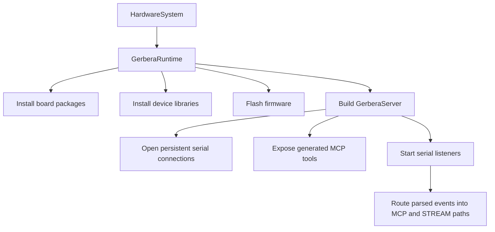
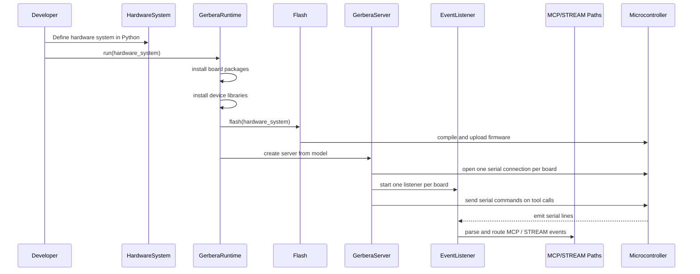

# gerbera-cli

Gerbera currently has two layers:

- `gerbera_cli`: local setup and board declaration
- `gerbera_sdk`: hardware modeling, firmware generation, flashing, server runtime, and event ingestion

## Current Goal

The current design is optimized for:

- explicit hardware declaration
- thin generated firmware
- simple serial commands
- generated MCP tools from the same hardware model
- one persistent serial owner per microcontroller
- internal event routing for both MCP responses and streaming telemetry

The hardware model defined by the developer is the source of truth.

## Boundaries

### `gerbera_cli`

The CLI is for machine-side setup:

- detect boards
- declare boards locally
- install Arduino packages manually when needed

It is not where hardware behavior is defined.

### `gerbera_sdk`

The SDK owns:

- hardware domain modeling
- command naming
- dependency resolution
- firmware generation
- firmware flashing
- server generation and runtime
- serial connection lifecycle
- event listener / buffer infrastructure

## Core Decisions

### Hardware is declared, not inferred

Gerbera does not try to guess what is wired to a board.

Developers define:

- the hardware system
- each microcontroller
- the `fqbn`
- each connection
- the pin-role mapping

### `Connection` is the callable unit

A `Connection` is one callable hardware capability on a board.

It becomes:

- a generated firmware handler
- a serial command name
- an MCP tool

### Pins use hardware-facing labels

Pin mappings should mirror real hardware labels and protocol roles.

Examples:

- `out`
- `tx`
- `rx`
- `sda`
- `scl`

### The firmware stays thin

Generated firmware should only:

- receive a command
- parse it
- route it
- touch hardware
- return raw data

It should not contain business logic.

### The command contract stays simple

The board receives a small string command rather than MCP JSON.

Examples:

```text
READ,room_temperature
WRITE,set_led,value:true
WRITE,set_motor,speed:120,direction:forward
```

### Serial ownership is centralized

Each microcontroller should have exactly one live serial connection owned by the runtime.

That connection is reused for:

- outbound tool commands
- inbound command responses
- inbound streaming telemetry

Gerbera should not open separate serial connections for MCP, database writes, or analytics.

### Inbound serial output is classified after parsing

Generated firmware should emit a small wire format such as:

```text
MCP,green_led,status:on
STREAM,obstacle_sensor,value:1
```

The runtime parses each line once, then routes it by purpose:

- `MCP` for one-off tool responses
- `STREAM` for continuous telemetry

### Event routing uses sibling paths

Gerbera uses two logical event paths after parsing:

- an MCP response path
- a streaming telemetry path

They are siblings because the same incoming data is being split by purpose, not passed through stacked broker stages.

### Buffers are shared infrastructure, not per-device infrastructure

Gerbera should not create a standalone buffer object for every device instance.

Instead it uses shared buffer managers by purpose:

- one MCP buffer manager
- one streaming buffer manager

Each manager can maintain internal keyed buckets, for example by:

- `microcontroller_id`
- `event_name`

### Domain models declare, runtime orchestrates

The domain layer should stay pure.

Models declare:

- structure
- relationships
- validation
- dependency metadata

The runtime layer performs:

- `arduino-cli` installs
- firmware flashing
- MCP server creation
- serial connection lifecycle

## Domain Model

Current hierarchy:

- `HardwareSystem`
  - many `Microcontroller`
- `Microcontroller`
  - many `Connection`
- `Connection`
  - one callable hardware capability

Current `Microcontroller` shape:

```python
@dataclass
class Microcontroller:
    id: str
    hardware_system_id: str
    port: str
    baud_rate: int
    fqbn: str
    description: str = ""
    firmware_file_path: str = ""
    connections: list[Connection] = field(default_factory=list)
```

## Domain Hierarchy



## Runtime Boundary



## Generation Model

Firmware generation is composed from a few focused parts:

- device builders such as `HW201FirmwareBuilder`
- `Parser`
- `Routing`
- `Generator`
- `Flash`

The builder owns device-specific code generation.

It declares:

- required Arduino libraries
- supported commands
- raw handler code

The shared generator layer builds:

- includes
- parser code
- handlers
- `setup()`
- `loop()`

The generated firmware is still intentionally thin:

- it should emit simple serial lines
- it should not know about databases, queues, or MCP internals

## Dependency Resolution

There are two dependency sources.

### Board-level packages

`HardwareSystem.get_required_microcontroller_packages()` resolves Arduino cores from the `fqbn` mapping.

Example:

```python
MICROCONTROLLER_MAPPING = {
    "arduino:avr:mega": {
        "includes": ["Arduino.h"],
        "libraries": ["arduino:avr"],
    },
}
```

### Device-level libraries

`Microcontroller.get_required_libraries()` resolves component libraries from each device builder.

Current builder contract:

```python
[
    {
        "install": "SomeLibrary",
        "include": "SomeLibrary.h",
    }
]
```

The runtime installs:

- board packages with `arduino-cli core install`
- device libraries with `arduino-cli lib install`

## Server Surface

The server is generated from the same hardware model.

Tool naming follows the action + connection contract:

- `read_room_temperature`
- `write_led`

Each tool:

- builds a serial command
- writes it through the persistent runtime-owned serial connection
- waits for the MCP response path to resolve the reply

The serial runtime, not the tool itself, owns inbound device output.

## Event Runtime

The runtime is moving toward this internal shape:

- one persistent serial connection per microcontroller
- one listener thread per microcontroller
- one parse step for each incoming line
- one split into two sibling paths:
  - MCP responses
  - streaming telemetry

The listener should stay lightweight:

- read a line
- attach `microcontroller_id`
- parse the wire format
- dispatch to the appropriate event path

Slower work such as database writes should happen after buffering, not inside the listener loop.

## Buffering Strategy

Buffers are live in-memory runtime objects.

Gerbera currently treats buffering as an internal runtime concern:

- a queue-like handoff protects ingestion from slower downstream work
- a batch buffer can accumulate stream payloads before writing them to a sink

Typical flush triggers are:

- batch size reached
- periodic timer
- runtime shutdown

At MVP stage, buffering is intended to stay in-process rather than requiring Redis, Kafka, or another external broker.

## End-to-End Flow


