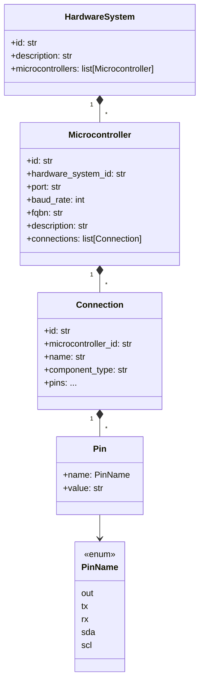
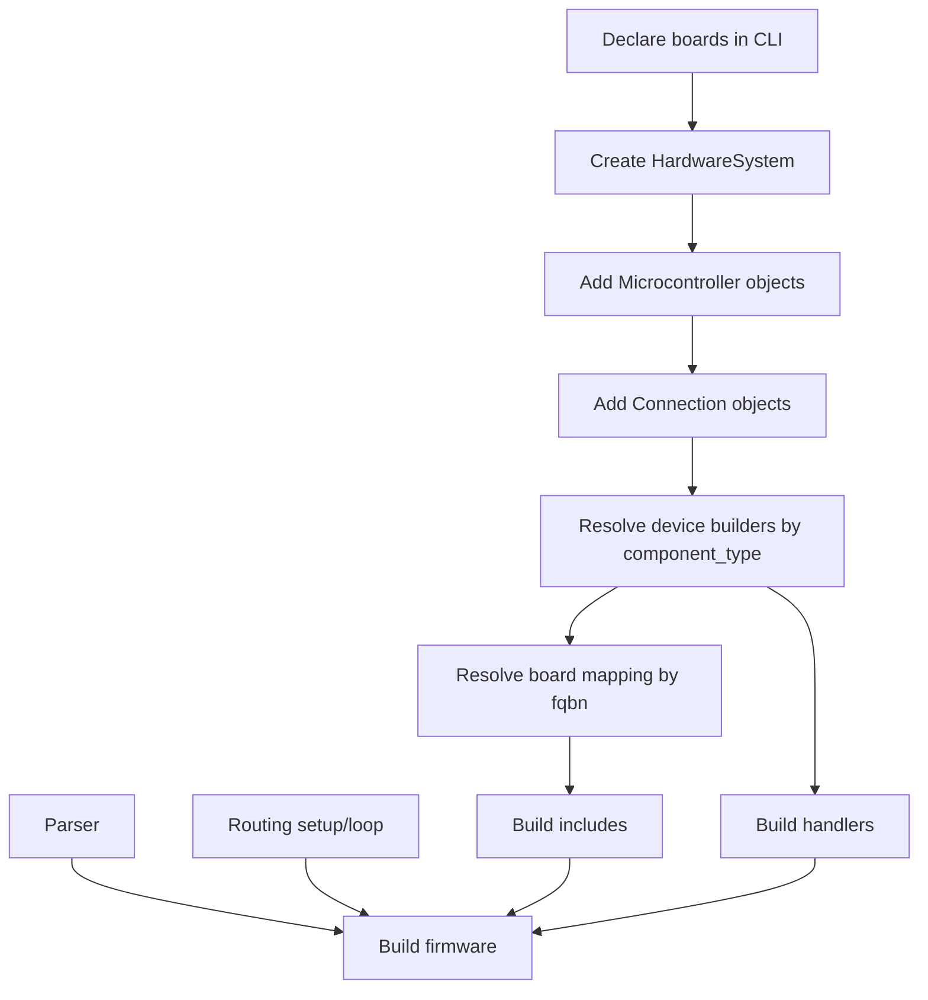

# gerbera-cli

Gerbera has two layers:

- `gerbera_cli`: local machine setup
- `gerbera_sdk`: hardware modeling plus generated device-side runtime

## Current Goal

The current goal is:

- declare boards explicitly
- model hardware capabilities in Python
- generate a thin firmware command layer
- keep device code small and push interpretation upward

## Boundaries

### `gerbera_cli`

The CLI is for machine-side setup:

- detect and declare boards
- install Arduino libraries
- install board cores

It is not where hardware behavior is defined.

### `gerbera_sdk`

The SDK is the source of truth for:

- hardware modeling
- command naming
- firmware generation
- parser, setup, and routing generation

## Core Decisions

### Hardware is declared, not inferred

Gerbera does not try to guess what is wired to a board.

Developers define:

- the board
- the `fqbn`
- the connections
- the pin roles

That keeps the system explicit and deterministic.

### `Connection` is the callable unit

A `Connection` is one callable hardware capability on a board.

It becomes:

- a generated firmware handler
- a command name in the runtime contract
- a future MCP-facing capability

### Pins use hardware-facing labels

Pins should mirror real hardware labels and protocol roles.

Examples:

- `out`
- `tx`
- `rx`
- `sda`
- `scl`

This is preferred over vague names like `signal` when the module already has a concrete label.

### The device layer stays thin

The firmware/device side should only:

- receive a command
- parse it
- route it
- touch hardware
- return raw data

It should not contain business logic or higher-level interpretation.

### The command contract stays simple

The board receives a small string command, not raw MCP JSON.

Examples:

```text
READ,room_temperature
WRITE,set_led,value:true
WRITE,set_motor,speed:120,direction:forward
```

### Parsing is shared

Parsing is generated once and reused by all handlers.

The generated parser produces:

- `action`
- `commandName`
- params

Handlers receive structured parsed input instead of splitting strings themselves.

### Reads are one-shot for MVP

For now, reads are one-shot requests rather than streams.

That keeps the runtime contract small and easy to extend later.

## Domain Model

Current intended hierarchy:

- `HardwareSystem`
  - many `Microcontroller`
- `Microcontroller`
  - many `Connection`
- `Connection`
  - pin mappings plus component type

Current `Microcontroller` shape:

```python
@dataclass
class Microcontroller:
    id: str
    hardware_system_id: str
    port: str
    baud_rate: int
    fqbn: str
    description: str = ""
    connections: list[Connection] = field(default_factory=list)
```

## Hierarchy



## Generation Model

Firmware generation is built from a few parts:

- `BaseFirmwareBuilder`
  - device-specific contract
- device builders like `HW201FirmwareBuilder`
  - declare required libraries
  - generate the raw handler body
- `Parser`
  - generates shared parsing code
- `Routing`
  - generates `setup()` and `loop()`
- `Libraries`
  - stitches includes, parser, handlers, setup, and loop together

## Include And Library Resolution

There are two sources of include/import information.

### 1. Device builder declarations

Each device builder declares required libraries through:

```python
def required_libraries(self) -> list[dict[str, str]]:
    ...
```

The current contract is:

- install name
- include/import name

Conceptually:

```python
[
    {
        "install": "SomeLibrary",
        "include": "SomeLibrary.h",
    }
]
```

### 2. Board-level `fqbn` mapping

`MICROCONTROLLER_MAPPING` is keyed by `fqbn`.

It can declare:

- board-level includes
- board-specific library import overrides

This means:

- component/device definitions stay the primary source of library needs
- `fqbn` can adjust the import name when a board needs something different

## Include Deduping

Generated includes are deduped before firmware assembly.

Deduping is normalized with:

- `.strip()`
- `.lower()`

But the first configured formatting is preserved in the generated firmware output.

## Generated Runtime Shape

The generated firmware is assembled from:

- includes
- `const int BAUD_RATE = ...`
- parser code
- generated handlers
- `setup()`
- `loop()`

For MVP, `setup()` is intentionally minimal:

```cpp
void setup() {
  Serial.begin(BAUD_RATE);
}
```

`loop()` then:

- reads a line
- parses it
- routes by `commandName`
- calls `handle_<connection_name>(command)`

## Flow



## Current Flow

1. Use the CLI to declare boards locally.
2. Build a `HardwareSystem` in Python.
3. Add `Microcontroller` objects with explicit `fqbn`.
4. Add `Connection` objects with explicit `component_type`.
5. Resolve device builders and board mapping.
6. Generate includes, parser, handlers, setup, and loop.
7. Use that generated layer as the bridge to the board.

## `devices.json`

`devices.json` is still the bridge from CLI setup to SDK modeling.

It should stay focused on board registry data rather than component behavior.

## What Is Out Of Scope Right Now

- automatic hardware detection
- streaming reads
- putting business logic on the board
- making the board understand MCP directly
- rich user-authored MCP schemas
- broad automatic inference of attached device capabilities

## Run

CLI help:

```bash
PYTHONPATH=src python -m gerbera_cli.main --help
```

Tests:

```bash
PYTHONPATH=src .venv/bin/pytest
```
