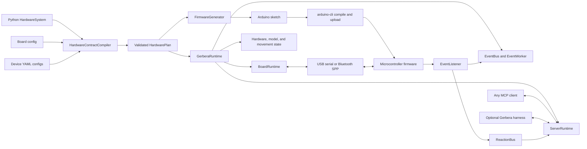
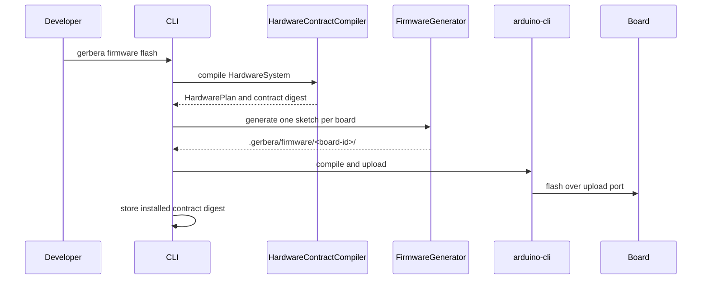
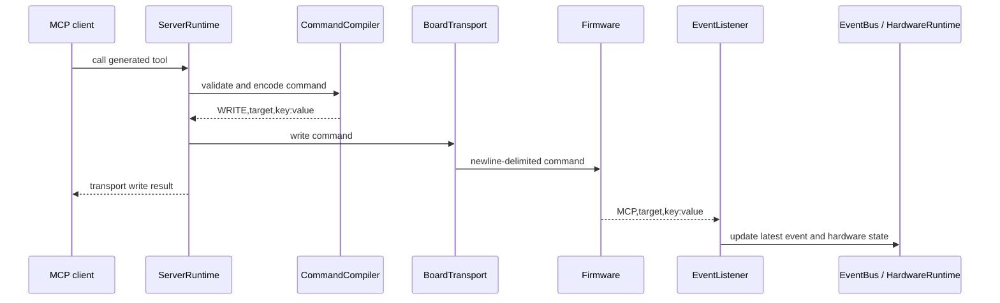
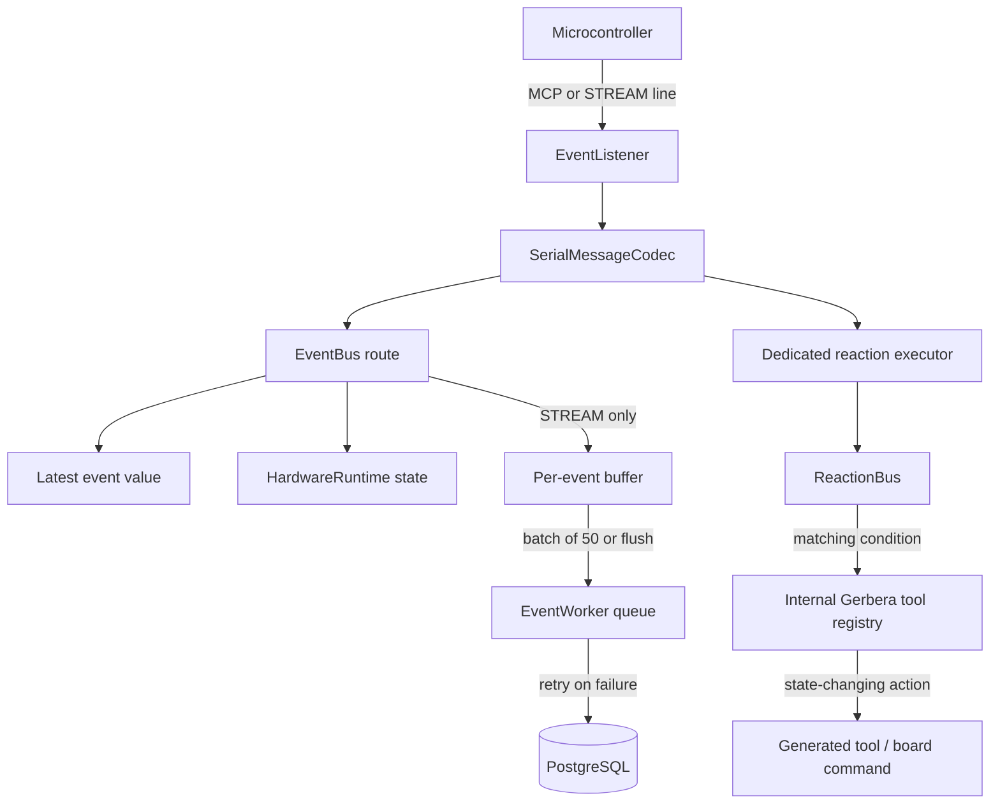

# Gerbera

Gerbera turns a Python hardware declaration into generated microcontroller
firmware and a local MCP server. The same validated hardware plan drives both
sides, so pin assignments, commands, event names, runtime tools, and firmware
stay aligned.

Gerbera provides:

- Arduino firmware generation and flashing
- USB serial and ESP32 Bluetooth Classic runtime transports
- MCP tools generated from declared hardware, cameras, models, and movement
  systems
- serial event ingestion and current hardware state
- buffered sensor-stream persistence to PostgreSQL
- persistent event reactions that invoke Gerbera tools locally
- an optional agent harness that can use the SDK through MCP

## Architecture


```mermaid
flowchart LR
    Declaration[Python HardwareSystem] --> Compiler[HardwareContractCompiler]
    BoardConfig[Board config] --> Compiler
    DeviceConfig[Device YAML configs] --> Compiler
    Compiler --> Plan[Validated HardwarePlan]

    Plan --> Generator[FirmwareGenerator]
    Generator --> Sketch[Arduino sketch]
    Sketch --> Flash[arduino-cli compile and upload]
    Flash --> Board[Microcontroller firmware]

    Plan --> Runtime[GerberaRuntime]
    Runtime --> BoardRuntime[BoardRuntime]
    Runtime --> ServerRuntime[ServerRuntime]
    Runtime --> EventRuntime[EventBus and EventWorker]
    Runtime --> StateRuntime[Hardware, model, and movement state]

    Client[Any MCP client] <--> ServerRuntime
    Harness[Optional Gerbera harness] <--> ServerRuntime
    BoardRuntime <--> Transport[USB serial or Bluetooth SPP]
    Transport <--> Board
    Board --> Listener[EventListener]
    Listener --> EventRuntime
    Listener --> Reactions[ReactionBus]
    Reactions --> ServerRuntime
```

The SDK is the hardware-facing system. It owns contracts, firmware, transports,
events, state, reactions, inference, movement, and MCP tool registration. The
optional harness is a separate MCP client: it discovers and calls the same tools
available to any other compatible client. The SDK does not import or depend on
the harness.

## Source of Truth

The developer declares a `HardwareSystem` containing microcontrollers,
connections, cameras, models, and movement systems. Each hardware connection
selects a `component_type`, such as `hw201`, `hcsr04`, `led`, or `dcmotor`.

Gerbera combines three inputs:

1. The Python `HardwareSystem` describes the concrete system and its wiring.
2. `firmware/boards/config.yaml` describes supported boards, pins, capabilities,
   transports, and Arduino packages.
3. `firmware/devices/configs/*.yaml` describes each component's pins, state,
   commands, validation, and firmware templates.

`HardwareContractCompiler` validates these inputs and produces an immutable
`HardwarePlan`. Validation covers board support, connection names, pin
capabilities, pin conflicts, transports, watchdogs, and movement connections.
Invalid declarations fail before firmware generation or runtime startup.

The resolved plan contains stable board IDs, resolved physical pins, supported
commands, event routes, and a contract digest. Both firmware generation and the
live runtime consume this plan.

## Build and Flash Flow


```mermaid
sequenceDiagram
    participant Developer
    participant CLI
    participant Compiler as HardwareContractCompiler
    participant Generator as FirmwareGenerator
    participant Arduino as arduino-cli
    participant Board

    Developer->>CLI: gerbera firmware flash
    CLI->>Compiler: compile HardwareSystem
    Compiler-->>CLI: HardwarePlan and contract digest
    CLI->>Generator: generate one sketch per board
    Generator-->>CLI: .gerbera/firmware/<board-id>/
    CLI->>Arduino: compile and upload
    Arduino->>Board: flash over upload port
    CLI->>CLI: store installed contract digest
```

Firmware is only reflashed when the compiled contract digest changes. Use
`gerbera firmware flash --force` to upload regardless of the stored digest.
Generated sketches parse Gerbera commands, operate pins and devices, run safety
checks, and emit structured event lines. They intentionally contain no MCP,
database, agent, or reaction logic.

## Runtime Startup

`GerberaRuntime.run(...)` is the composition root. Before serving MCP requests,
it creates and connects the runtime components in this order:

1. Compile and validate the current `HardwareSystem`.
2. Create board, camera, model, event, reaction, hardware-state, and optional
   movement runtimes.
3. Register event routes and MCP tools from the resolved plan.
4. Open one runtime transport per microcontroller.
5. Perform a nonce-based handshake and verify protocol version, board ID, and
   contract digest.
6. Run each component's firmware health check.
7. Start the firmware session and board heartbeat.
8. Start cameras, inference streams, the database event worker, and serial
   listener threads.
9. Serve the generated tools through FastMCP.

If the connected firmware does not match the current hardware plan, startup
fails instead of operating against a stale board contract. Shutdown stops
listeners and inference, flushes event buffers, waits for database writes, and
closes transports and cameras.

## Command Flow

State-changing MCP tools are generated from the commands in each device YAML
configuration.


```mermaid
sequenceDiagram
    participant Client as MCP client
    participant Server as ServerRuntime
    participant Compiler as CommandCompiler
    participant Transport as BoardTransport
    participant Firmware
    participant Listener as EventListener
    participant State as EventBus / HardwareRuntime

    Client->>Server: call generated tool
    Server->>Compiler: validate and encode command
    Compiler-->>Server: WRITE,target,key:value
    Server->>Transport: write command
    Transport->>Firmware: newline-delimited command
    Server-->>Client: transport write result
    Firmware-->>Listener: MCP,target,key:value
    Listener->>State: update latest event and hardware state
```

A successful write result means the command was validated and written to the
transport. The board's resulting `MCP` wire event arrives asynchronously and
updates the event and hardware-state stores.

Read tools return the latest cached `MCP` event for their connection. State
tools expose snapshots such as `get_current_hardware_state` and
`get_current_environment_state`.

## Event and Streaming Flow

Firmware emits newline-delimited messages using this shape:

```text
<message_type>,<target>,<field>:<value>,<field>:<value>
```

Examples:

```text
MCP,led_8e910dfb_f928a260,state:on
STREAM,hw201_8e910dfb_e8f75c2b,obstacle_detected:1
```

The event route is the tuple:

```text
(event_type, microcontroller_id, event_name)
```

`event_name` is generated as:

```text
<component_type>_<short_microcontroller_hash>_<short_connection_hash>
```

This gives firmware, event routing, reactions, and database tables the same
stable, PostgreSQL-safe identifier.

For every received `MCP` or `STREAM` line, `EventListener` decodes the message
and sends the payload down two independent paths:


```mermaid
flowchart TD
    Board[Microcontroller] -->|MCP or STREAM line| Listener[EventListener]
    Listener --> Decode[SerialMessageCodec]
    Decode --> EventBus[EventBus route]
    Decode --> ReactionExecutor[Dedicated reaction executor]

    EventBus --> Latest[Latest event value]
    EventBus --> HardwareState[HardwareRuntime state]
    EventBus -->|STREAM only| Buffer[Per-event buffer]
    Buffer -->|batch of 50 or flush| Worker[EventWorker queue]
    Worker -->|retry on failure| Database[(PostgreSQL)]

    ReactionExecutor --> ReactionBus[ReactionBus]
    ReactionBus -->|matching condition| ToolRegistry[Internal Gerbera tool registry]
    ToolRegistry -->|state-changing action| BoardCommand[Generated tool / board command]
```

The serial listener does not perform database writes or reaction actions
directly. Database work runs on `EventWorker`, and reaction evaluation runs on a
dedicated single-worker executor. This keeps serial reads isolated from slower
consumers.

Stream buffers flush when they reach 50 records, when streaming is turned off,
or during shutdown. Each database job owns a copy of its batch and retries up to
the configured limit.

## Reactions

Reactions provide server-local automation without coupling the SDK to a
particular harness. Any MCP client can use:

- `create_reaction`
- `list_reactions`
- `delete_reaction`

Use `list_reaction_events` to discover valid event routes. A reaction declares:

- an event route and payload field
- a typed comparison and expected value
- an existing state-changing Gerbera tool plus its arguments
- `once` or `continuous` execution
- an optional cooldown

When an event arrives, the reaction bus reads the selected field, evaluates the
condition, and invokes the action through the server's internal tool registry.
It does not make an HTTP request back to its own MCP endpoint. Read-only tools
and reaction-management tools cannot be actions.

`once` reactions are deleted before action execution, so they run at most once
even if the action fails. `continuous` reactions remain until explicitly
deleted, honor their cooldown, and cannot overlap themselves.

Definitions persist at:

```text
.gerbera/reactions/<reaction-id>.json
```

They are validated and restored at server startup. Runtime observations such as
latest value, trigger count, last result, and last error remain in memory.

See [Reaction details](src/gerbera_sdk/events/reactions/README.md).

## Cameras and Models

`CameraRuntime` owns configured camera capture and the latest frames.
`ModelRuntime` registers inference adapters and exposes tools for single
inference, continuous inference, and reading model output. Continuous model
workers read the latest frame, run the configured strategy, and update the
in-memory environment state returned by `get_current_environment_state`.

Camera and model data does not pass through the microcontroller serial protocol.
It stays on the host and is exposed through the same MCP server as hardware
tools.

## Optional Harness

The harness is an MCP client and agent orchestration layer. It owns sessions,
planning, execution, review, memory, LLM adapters, local tools, and sandbox
access. It discovers the Gerbera server's MCP tools and calls them like any
other client.

```text
user request
  -> harness API
  -> agent runtime
  -> planning / execution / review
  -> MCP client
  -> standalone Gerbera MCP server
  -> hardware, models, movement, or reaction tools
```

Hardware event ingestion and reaction execution stay inside the SDK. The
harness is not required to run the hardware server or its reactions.

## ESP32 Bluetooth Classic

The original ESP32 Dev Module can use Bluetooth Classic SPP as its runtime
transport while keeping USB as the firmware upload connection. Configure the
machine-specific endpoints in `config.json`:

```json
{
  "devices": {
    "esp32-1": {
      "id": "esp32-1",
      "address": "/dev/cu.usbserial-0001",
      "runtime_transport": {
        "kind": "bluetooth_classic",
        "port": "/dev/cu.Gerbera-ESP32",
        "device_name": "Gerbera-ESP32"
      }
    }
  }
}
```

The hardware declaration retains the stable device ID and upload port:

```python
microcontroller = Microcontroller(
    name="robot-controller",
    port="/dev/cu.usbserial-0001",
    upload_port="/dev/cu.usbserial-0001",
    device_id="esp32-1",
    fqbn="esp32:esp32:esp32",
    watchdog=RuntimeWatchdogConfig(
        heartbeat_interval_ms=500,
        heartbeat_timeout_ms=2500,
    ),
)
```

Flash once over USB, pair the ESP32 with the host, and run the server against
the paired serial endpoint. USB serial and Bluetooth SPP use the same Gerbera
wire protocol and runtime interfaces. Bluetooth does not provide OTA firmware
updates; firmware changes still require the upload connection.

## Project Layout

```text
src/gerbera_cli/                 CLI initialization, provisioning, flashing, and startup
src/gerbera_sdk/                 Standalone hardware SDK and MCP server
src/gerbera_sdk/firmware/        Board/device definitions and firmware generation
src/gerbera_sdk/models/hardware/ Hardware declarations and contract validation
src/gerbera_sdk/models/runtime/  Board, server, state, model, camera, and movement runtimes
src/gerbera_sdk/events/          Event routing, buffering, persistence, and reactions
src/gerbera_sdk/inference/       Inference models and runtime strategies
src/gerbera_harness/             Optional agent orchestration client
tests/                           Unit and integration tests
config.json                      Machine-local device and entry-point configuration
.gerbera/                        Generated firmware, model artifacts, reactions, and secrets
```

## Runtime Ownership

| Component | Owns |
| --- | --- |
| `GerberaRuntime` | Dependency construction and top-level setup/run entry points |
| `HardwareContractCompiler` | Validation and immutable runtime plan creation |
| `FirmwareGenerator` / `Flash` | Sketch generation, compilation, upload, and installed digest |
| `BoardRuntime` | Transports, startup verification, sessions, heartbeats, and reconnection |
| `ServerRuntime` | MCP event and tool registration plus command dispatch |
| `EventListener` | Per-board serial reads and event dispatch |
| `EventBus` / `Buffer` | Latest event values and stream batching |
| `EventWorker` | Asynchronous database writes and retry |
| `HardwareRuntime` | Current connection-state snapshot |
| `ReactionBus` | Persisted event conditions and local tool actions |
| `CameraRuntime` / `ModelRuntime` | Host camera frames and inference state |
| `MovementRuntime` | Movement registration, state, and kinematics |
| `gerbera_harness` | Optional agent reasoning and MCP client orchestration |

## Main CLI Lifecycle

```text
gerbera init
  Create config.json and the .gerbera workspace.

gerbera firmware flash
  Validate, generate, compile, and upload changed firmware.

gerbera firmware flash --force
  Upload firmware even when the installed digest is current.

gerbera server
  Start the standalone Gerbera MCP hardware server.

gerbera up
  Provision local supporting services and start the optional harness.
```

## Detailed Documentation

- [SDK overview](src/gerbera_sdk/README.md)
- [Hardware model](src/gerbera_sdk/models/hardware/README.md)
- [Runtime model](src/gerbera_sdk/models/runtime/README.md)
- [Firmware generation](src/gerbera_sdk/firmware/README.md)
- [Events](src/gerbera_sdk/events/README.md)
- [Reactions](src/gerbera_sdk/events/reactions/README.md)
- [Harness](src/gerbera_harness/README.md)
