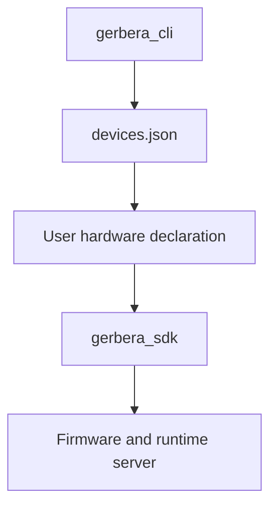

# Source Packages

The `src` folder contains the installable Python packages for Gerbera.

## Packages

```text
gerbera_cli/    Local CLI helpers for board setup and tunnels.
gerbera_sdk/    SDK domain model, firmware generation, runtime server, events.
```

## Flow



## Rule

Keep CLI concerns in `gerbera_cli` and runtime/domain concerns in `gerbera_sdk`.
