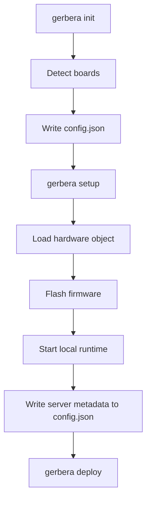

# Gerbera CLI

The CLI folder owns local developer commands for board discovery, local runtime bring-up, and external deployment steps.

It is separate from the SDK runtime. The CLI prepares and orchestrates the local environment; the SDK defines and runs the hardware system.

## First Run

From the repository root, install Gerbera in editable mode:

```bash
python -m pip install -e .
```

Ensure `arduino-cli` and `ngrok` are installed and available on `PATH`, connect
the microcontroller, then run the first Gerbera command:

```bash
gerbera init
```

The `init` command detects attached boards and asks for:

- the boards to manage
- the Python hardware entry point, such as `index.py`
- the `HardwareSystem` variable name, such as `hardware`

It writes those choices to `config.json`. Next, define that hardware variable in
the selected entry-point file and start local setup:

```bash
gerbera setup
```

`setup` loads the declared hardware, installs firmware dependencies, flashes the
boards, starts ngrok, writes the local and public MCP endpoints to `config.json`,
and runs the local server until interrupted. Stop it with `Ctrl+C`.

The current order is therefore:

```text
install -> gerbera init -> define hardware -> gerbera setup
```

`gerbera deploy` is registered but currently only loads configuration; it is not
part of the functional first-run flow yet.

## Device Address Stability

Serial addresses such as `/dev/cu.usbserial-130` are connection locations, not
stable device identifiers. They may change after reconnecting a board, changing
USB ports, or attaching devices in a different order.

The current MVP uses the serial address in both `config.json` and the Python
hardware declaration. If it changes, rerun `gerbera init` and update the
microcontroller `port` in the hardware entry point.

Future device discovery should preserve the Gerbera UUID by matching a board's
USB serial number, then update its current address. VID and PID alone are not
enough because multiple identical boards can share them.

## Folders

```text
initialise/     Hardware discovery and config bootstrap.
setup/          Local runtime bring-up and tunnel startup.
deploy/         External deployment and agent-facing orchestration.
```

## Ownership

The CLI owns:

- detecting attached boards
- writing local board declarations into `config.json`
- loading the user-declared hardware entry point
- local setup and runtime orchestration
- external deployment commands

The CLI does not own:

- hardware behavior definitions
- firmware device builders
- runtime MCP server internals
- serial event buffering

## Flow



## Rule

CLI orchestration can feed the SDK runtime, but hardware behavior should stay in SDK models and firmware device builders.
