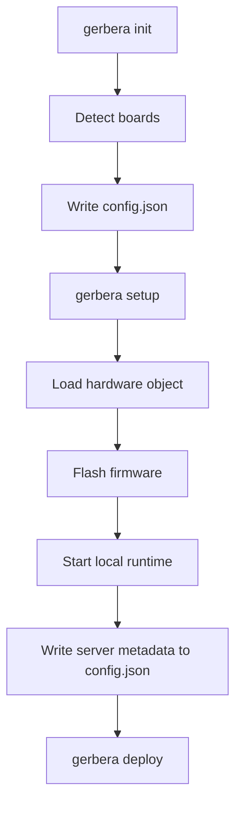

# Gerbera CLI

The CLI folder owns local developer commands for board discovery, local runtime bring-up, and external deployment steps.

It is separate from the SDK runtime. The CLI prepares and orchestrates the local environment; the SDK defines and runs the hardware system.

## Folders

```text
initialise/     Hardware discovery and config bootstrap.
setup/          Local runtime bring-up and tunnel startup.
deploy/         External deployment and agent-facing orchestration.
```

## Ownership

The CLI owns:

- detecting attached boards
- writing local board declarations into `config.json`
- loading the user-declared hardware entry point
- local setup and runtime orchestration
- external deployment commands

The CLI does not own:

- hardware behavior definitions
- firmware device builders
- runtime MCP server internals
- serial event buffering

## Flow



## Rule

CLI orchestration can feed the SDK runtime, but hardware behavior should stay in SDK models and firmware device builders.
