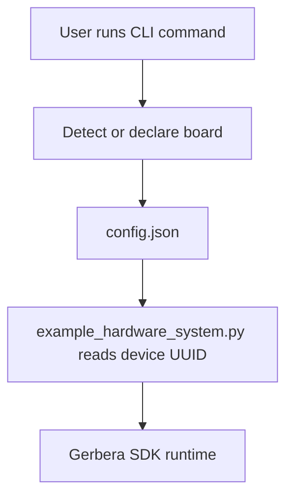

# Gerbera CLI

The CLI folder owns local developer commands around machine and board setup.

It is separate from the SDK runtime. The CLI helps prepare the local environment; the SDK defines and runs the hardware system.

## Folders

```text
commands/       CLI command implementations.
ngrok/          Local tunnel helper scaffolding.
```

## Ownership

The CLI owns:

- detecting attached boards
- writing local board declarations into `config.json`
- command-line setup helpers
- optional tunnel helper commands

The CLI does not own:

- hardware behavior definitions
- firmware device builders
- runtime MCP server internals
- serial event buffering

## Flow



## Rule

CLI output can feed the SDK, but hardware behavior should stay in SDK models and device builders.
