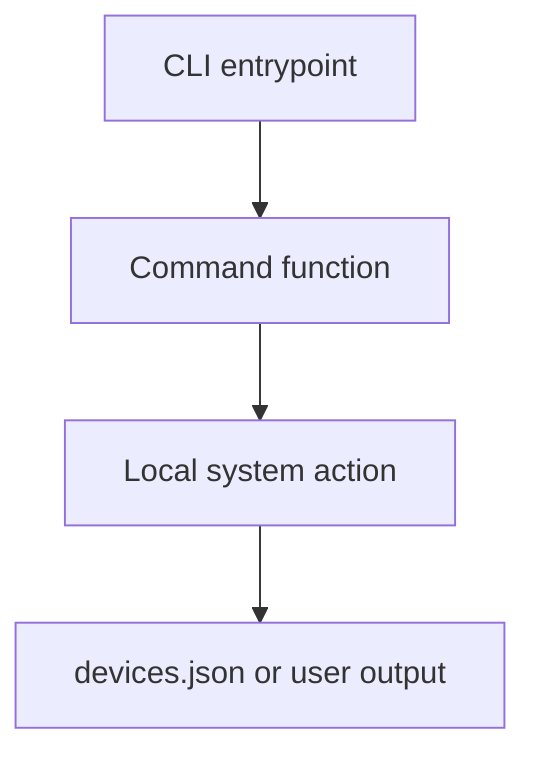

# CLI Commands

This folder owns individual CLI command implementations.

Each command should be small and focused on local setup behavior.

## Ownership

Commands may:

- inspect local hardware
- write local registry files
- call setup helpers
- print actionable user output

Commands should not:

- define firmware device behavior
- bypass SDK models
- open long-lived runtime serial listeners

## Flow

