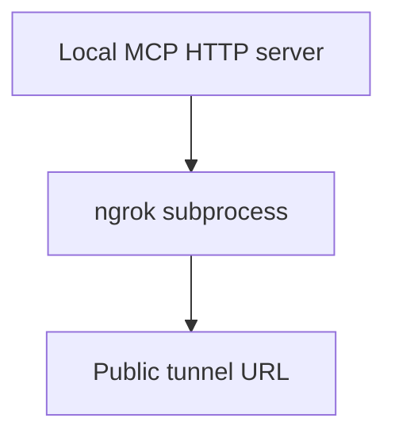

# Ngrok Helpers

This folder is for optional local tunnel helpers.

It should remain thin. The tunnel is infrastructure around serving MCP over HTTP; it is not part of firmware generation or event routing.

## Ownership

This folder may own:

- shelling out to the ngrok CLI
- validating ngrok availability
- exposing local server ports for demos

This folder should not own:

- MCP tool definitions
- server internals
- authentication policy
- hardware model logic

## Flow

