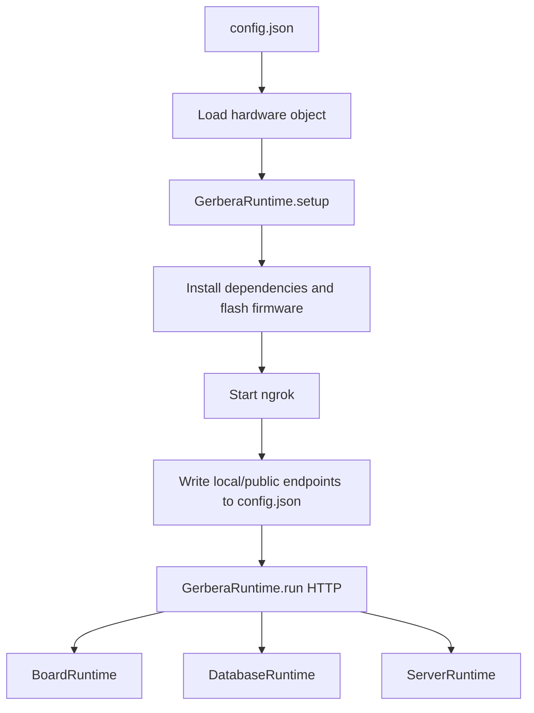

# Setup

This folder owns local runtime bring-up after hardware has been declared.

The setup flow loads the configured hardware object, installs and flashes firmware, starts ngrok, and delegates the board, database, event, and MCP server lifecycle to `GerberaRuntime`.

## Ownership

This folder may own:

- loading the hardware object from `config.json`
- installing firmware dependencies
- flashing firmware
- starting the local HTTP runtime
- starting and stopping ngrok
- writing server endpoint metadata into `config.json`

This folder should not own:

- device discovery and registration
- hardware model definitions
- external agent deployment logic
- cloud orchestration beyond local runtime exposure

## Flow

