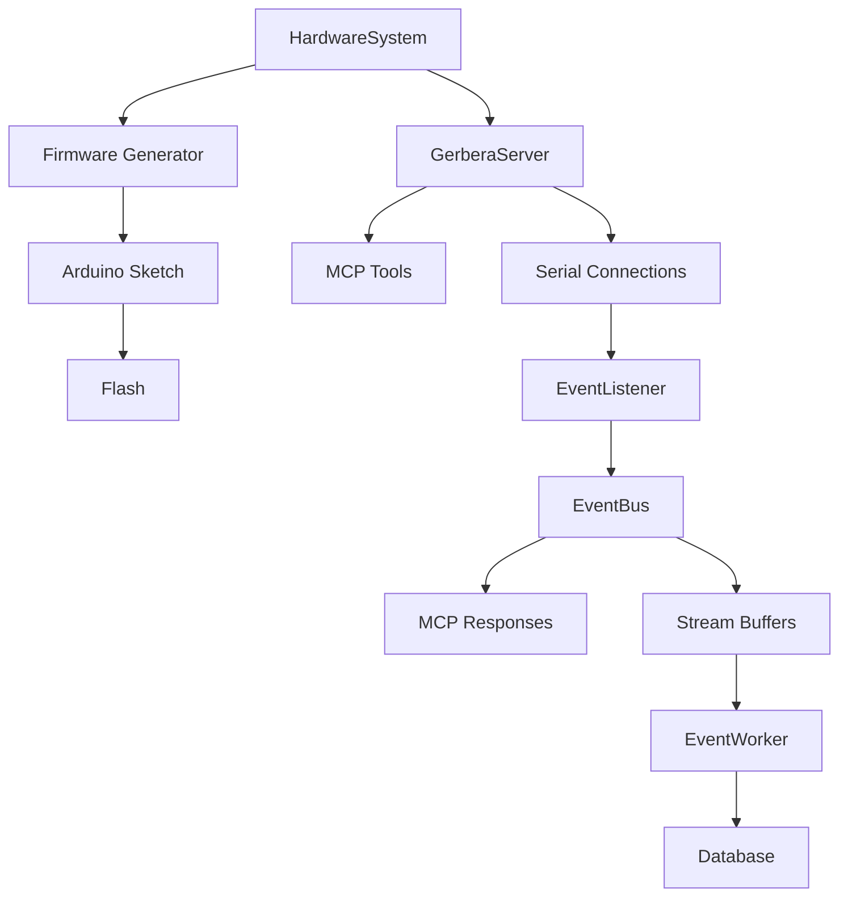

# Gerbera SDK

The SDK owns the hardware model, firmware generation, flashing, MCP server runtime, serial event ingestion, and optional database streaming.

It is the source of truth for how hardware declarations become generated behavior.

## Folders

```text
contracts/          Typed specs shared by builders, commands, schemas.
models/             HardwareSystem, Microcontroller, Connection, Database.
firmware/           Arduino firmware generation and flashing.
firmware/devices/   Per-component firmware builders.
events/             Event bus, listener, buffers, stream lifecycle, DB worker.
server/             MCP server, serial command execution, tool registration.
```

## Ownership Boundary

The SDK owns:

- domain model validation
- device builder contracts
- command compilation
- Arduino sketch generation
- serial connection lifecycle
- event routing
- buffered streaming writes

The SDK does not own:

- physical wiring discovery
- business analytics
- dashboard/UI presentation
- cloud database provisioning

## High-level Flow



## Runtime Entry Point

Use `GerberaRuntime` in `main.py`:

- `setup(...)`: install dependencies and flash firmware
- `create_server(...)`: create a `GerberaServer`
- `serve(...)`: run the server and close cleanly
- `run(...)`: alias for serve
