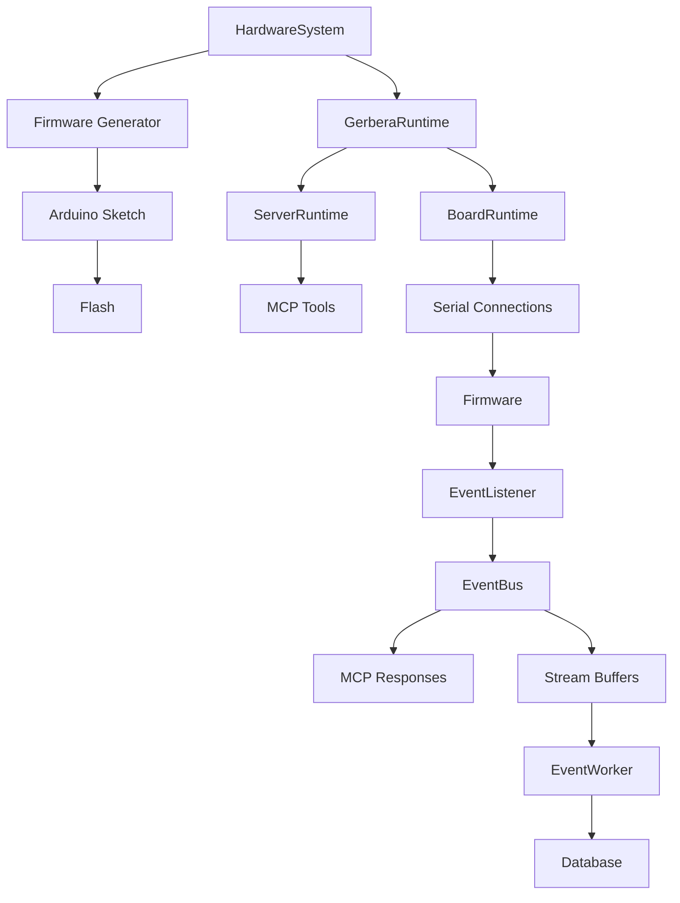

# Gerbera SDK

The SDK owns the hardware declaration model, firmware generation and flashing, and the runtime that exposes declared devices over MCP.

It is the layer that turns a declared hardware system into:

- generated firmware
- flashed microcontrollers
- serial command execution
- MCP tool exposure
- event and stream handling

## Folders

```text
contracts/          Shared typed contracts for commands, firmware, and schemas.
events/             Event bus, listener, buffers, stream flushing, DB worker.
firmware/           Firmware generation, flashing, and device builders.
harness/            Agent and rule-engine support around the SDK runtime.
models/             Hardware declarations and runtime support objects.
utils.py            Cross-cutting helpers such as event naming and identifiers.
gerbera_runtime.py  Top-level composition root for setup and run.
```

## Ownership Boundary

The SDK owns:

- hardware declaration validation
- command contracts and serialization
- firmware generation and flashing
- runtime composition for board and server behavior
- MCP tool registration
- serial event ingestion
- buffered stream persistence

The SDK does not own:

- physical wiring discovery
- dashboards or UI presentation
- cloud/database provisioning outside the declared connection info
- application-specific business logic on top of device events

## High-Level Flow



## Runtime Entry Point

Use `GerberaRuntime` in [gerbera_runtime.py](/Users/jiexuanliu/Desktop/firecracker/cli/src/gerbera_sdk/gerbera_runtime.py):

- `setup(...)`
  Installs Arduino dependencies and flashes firmware when requested.

- `run(...)`
  Builds `BoardRuntime` and `ServerRuntime`, registers events and tools, starts the listener, runs the MCP app, and closes resources on exit.

## Runtime Shape

Current runtime responsibilities are split like this:

- `BoardRuntime`
  Owns live serial connections for declared microcontrollers.

- `ServerRuntime`
  Owns event registration, tool registration, command dispatch, and MCP app interaction.

- `GerberaRuntime`
  Is the composition root that wires board and server runtime pieces together in the right order.
