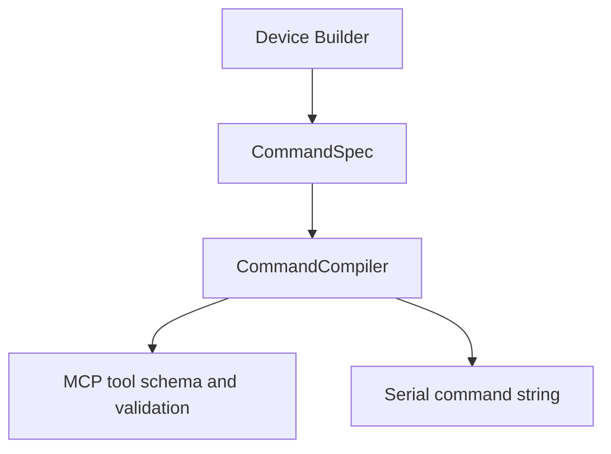
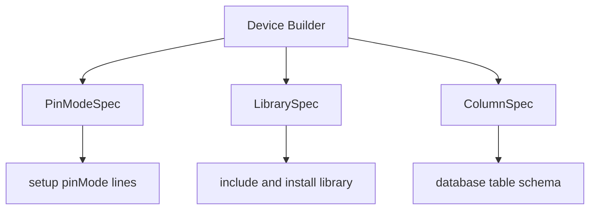

# Contracts

The contracts folder owns small typed specifications shared across the SDK.

Contracts describe what a device or database table needs. They do not perform runtime work.

## Files

```text
command_contract.py     CommandSpec, ParameterSpec, ParameterType.
firmware_contract.py    PinModeSpec, LibrarySpec, ColumnSpec, ColumnType.
```

## Ownership

This folder owns:

- valid command parameter metadata
- parameter types, enum values, min/max constraints
- pin mode declarations
- Arduino library declarations
- database column declarations

This folder does not own:

- command string generation
- serial IO
- database writes
- firmware C++ generation

## Command Contract Flow



## Firmware Contract Flow



## Rule

Keep contracts descriptive and inert. If a class starts doing IO or runtime orchestration, it belongs elsewhere.
