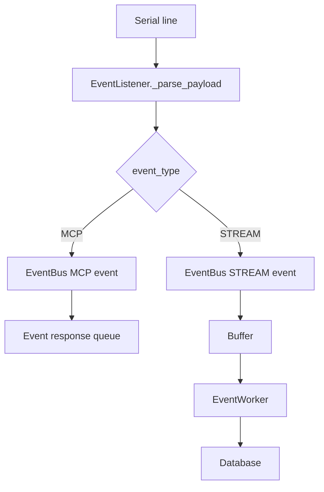
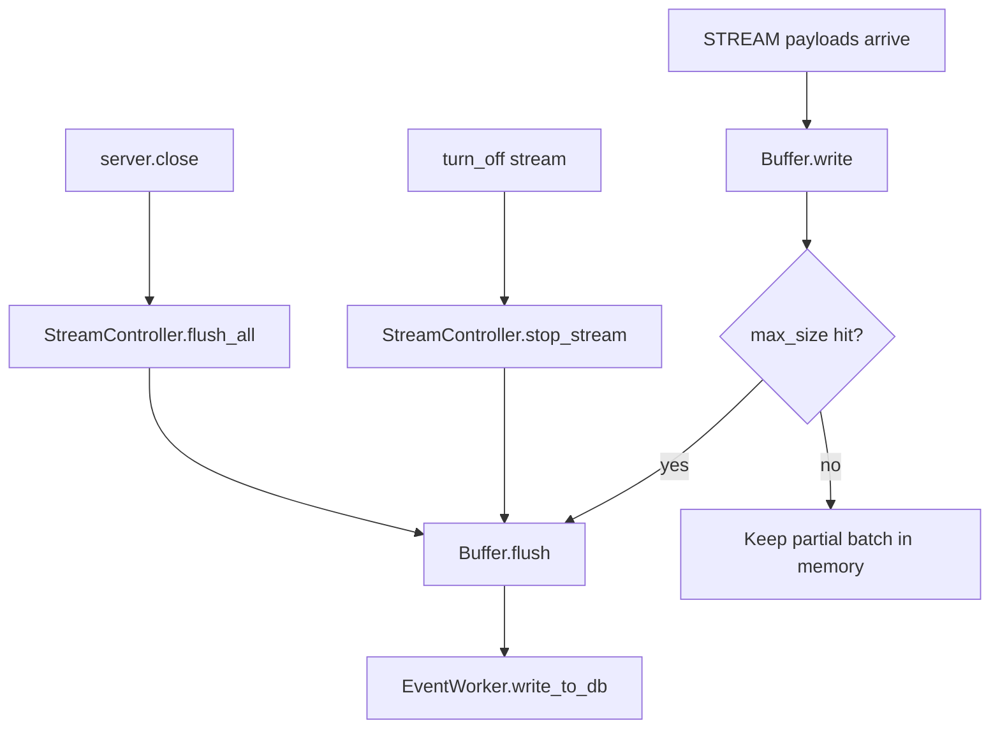

# Events

The events folder owns inbound serial routing, event dispatch, stream buffering, and stream lifecycle cleanup.

## Files

```text
event_listener.py       Background serial reader per microcontroller.
event_bus.py            Event registry and routing lookup.
event.py                MCP response events and STREAM buffer events.
buffer.py               In-memory batch buffer.
event_worker.py         Injected write queue consumed under DatabaseRuntime lifecycle.
stream_controller.py    Stream lifecycle operations such as flush on stop.
```

## Ownership

This folder owns:

- parsing incoming serial event lines
- routing by `(event_type, microcontroller_id, event_name)`
- buffering stream payloads
- flushing partial stream buffers
- queueing stream batches for the database runtime

This folder does not own:

- firmware generation
- tool schema generation
- serial command construction
- Arduino flashing

## Incoming Serial Flow



## Stream Lifecycle Flow



## Buffering Pattern

This is an event-driven producer-consumer pipeline with write-behind batch buffering.

- Producer: serial listener
- Router: event bus
- Buffer: per stream event
- Consumer: event worker
- Sink: database

Partial batches flush on stream-off and server shutdown.

## Event Name

The `event_name` parsed from firmware payloads is `connection.event_name`.

Payload shape:

```text
MCP,<event_name>,key:value
STREAM,<event_name>,key:value
```

That identifier is generated from:

- `component_type`
- a short hash of `microcontroller_id`
- a short hash of the canonicalized `pins` mapping

This keeps routing and stream table naming stable while avoiding collisions for same-type devices on the same board.
