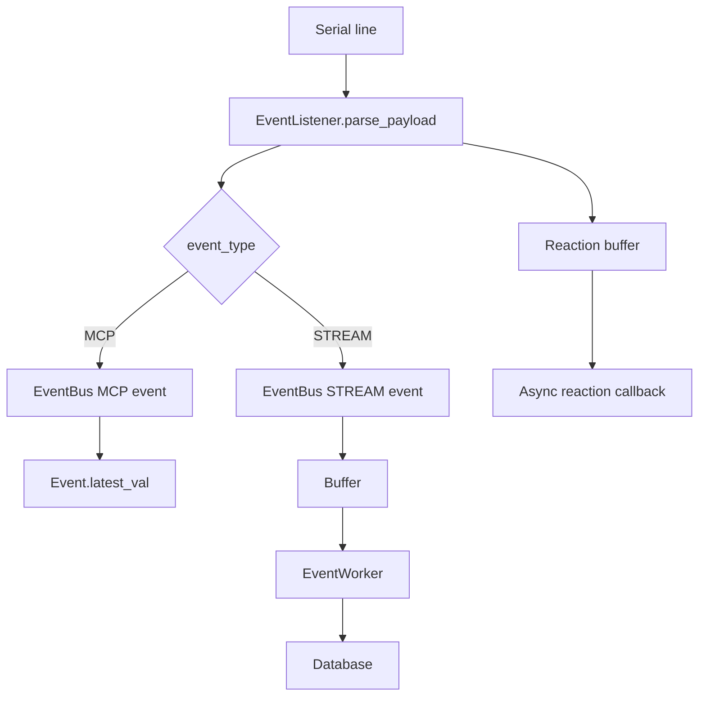
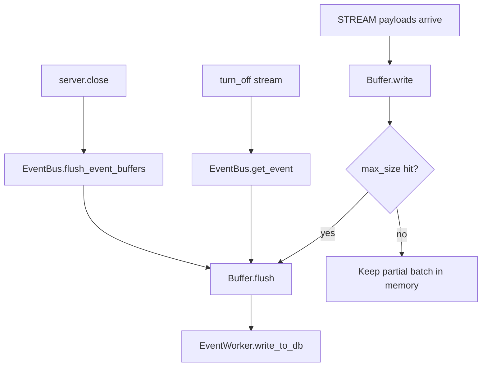

# Events

The events folder owns inbound serial routing, event dispatch, stream buffering, and stream lifecycle cleanup.

## Files

```text
event_listener.py       Background serial reader per microcontroller.
event_bus.py            Event registry and routing lookup.
event.py                MCP response events and STREAM buffer events.
buffer.py               In-memory batch buffer.
event_worker.py         Background queue for database stream writes.
reactions/                  Event reactions, conditions, callbacks, and latest values.
```

## Ownership

This folder owns:

- parsing incoming serial event lines
- routing by `(event_type, microcontroller_id, event_name)`
- buffering stream payloads
- flushing partial stream buffers
- queueing stream batches for the database
- evaluating registered event reactions without blocking serial listeners

This folder does not own:

- firmware generation
- tool schema generation
- serial command construction
- Arduino flashing

## Incoming Serial Flow


```mermaid
flowchart TD
    A[Serial line] --> B[EventListener.parse_payload]
    B --> C{event_type}
    C -->|MCP| D[EventBus MCP event]
    C -->|STREAM| E[EventBus STREAM event]
    D --> F[Event.latest_val]
    E --> G[Buffer]
    B --> R[Reaction buffer]
    R --> S[Async reaction callback]
    G --> H[EventWorker]
    H --> I[Database]
```

## Stream Lifecycle Flow


```mermaid
flowchart TD
    A[STREAM payloads arrive] --> B[Buffer.write]
    B --> C{max_size hit?}
    C -->|yes| D[Buffer.flush]
    C -->|no| E[Keep partial batch in memory]
    F[turn_off stream] --> G[EventBus.get_event]
    G --> D
    H[server.close] --> I[EventBus.flush_event_buffers]
    I --> D
    D --> J[EventWorker.write_to_db]
```

## Buffering Pattern

This is an event-driven producer-consumer pipeline with write-behind batch buffering.

- Producer: serial listener
- Router: event bus
- Buffer: per stream event
- Consumer: event worker
- Sink: database

Partial batches flush on stream-off and server shutdown.

## Event Name

The `event_name` parsed from firmware payloads is `connection.event_name`.

Payload shape:

```text
MCP,<event_name>,key:value
STREAM,<event_name>,key:value
```

Successful MCP and STREAM payloads use semantic payload keys:

```text
MCP,<event_name>,distance:<reading>
STREAM,<event_name>,distance:<reading>
MCP,<event_name>,stream_enabled:<0-or-1>
MCP,<event_name>,led_state:<0-or-1>
MCP,<event_name>,angle:<degrees>
```

The payload key is the hardware state field. Runtime routes it directly into
hardware state memory as:

```text
<component_type>.<connection_name>.<payload_key>
```

Each firmware device builder must define units for every state field it emits:

```python
def state_definitions(self) -> dict[str, dict[str, str | None]]:
    return {
        "units": {
            "distance": "cm",
            "stream_enabled": None,
        },
    }
```

Runtime validates the payload key against `state_definitions()["units"]`
before updating state memory.

Examples:

```python
# HW201 digital sensor
{"hw201.ir_sensor.obstacle_detected": {"value": "1", "unit": None}}

# HC-SR04 distance sensor
{"hcsr04.distance_sensor.distance": {"value": "12.4", "unit": "cm"}}

# SG90 servo response
{"sg90.servo_motor.angle": {"value": "90", "unit": "degrees"}}
```

Stream helper tools also maintain `stream_enabled`, but serial MCP/STREAM
readings and normal write acknowledgements now report returned data under the
semantic state field they modify or observe.

That identifier is generated from:

- `component_type`
- a short hash of `microcontroller_id`
- a short hash of the canonicalized `pins` mapping

This keeps routing and stream table naming stable while avoiding collisions for same-type devices on the same board.
