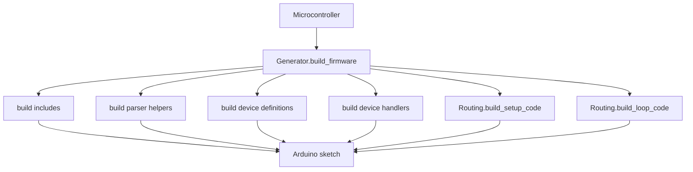

# Firmware

The firmware folder owns Arduino sketch generation, parsing code, command routing, setup generation, and flashing.

## Files

```text
configurations.py       Registry for supported devices and microcontroller packages.
generator.py            Assembles complete Arduino sketches.
parser.py               Generates command parser helpers.
routing.py              Generates setup() and loop() dispatch code.
flash.py                Compiles/uploads generated sketches.
devices/                Per-component firmware builders.
```

## Ownership

This folder owns:

- mapping `component_type` to a firmware builder
- generated Arduino includes
- generated global definitions
- generated handlers
- generated setup and loop code
- flashing firmware through Arduino tooling

This folder does not own:

- serial runtime connections
- MCP tool registration
- database write buffering
- event listener threads

## Generation Flow



## Wire Protocol

Commands sent to Arduino:

```text
READ,<connection.name>
WRITE,<connection.name>,key:value,key:value
```

Responses emitted by Arduino:

```text
MCP,<connection.event_name>,key:value
STREAM,<connection.event_name>,key:value
```

`connection.event_name` is the runtime-safe internal identifier. It is generated from:

- `component_type`
- a short hash of `microcontroller_id`
- a short hash of the canonicalized `pins` mapping

This same identifier is reused for:

- firmware serial output
- event bus routing
- stream table naming

## Rule

Keep generated firmware thin. It should parse command strings, touch hardware, and emit structured serial lines.
