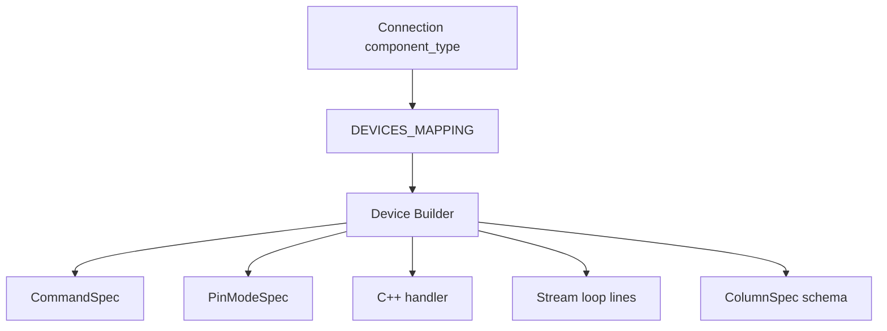

# Firmware Device Builders

This folder owns per-component firmware generation.

Each file implements one hardware component type such as `led`, `hw201`, `hcsr04`, `ky033`, `sg90`, `mg996r`, or `dcmotor`.

## Ownership

Device builders own:

- required Arduino libraries
- required pin modes
- supported commands
- generated C++ handler code
- optional global definitions
- optional setup lines
- optional streaming loop lines
- optional database schema

Device builders do not own:

- serial port lifecycle
- MCP server registration
- event bus registration
- database writes

## Builder Contract

Every builder extends `BaseFirmwareBuilder` and implements:

```python
required_libraries(...)
pin_modes(...)
required_commands(...)
build_handler(...)
```

Optional hooks:

```python
build_definitions(...)
build_setup_lines(...)
build_stream_lines(...)
required_schema(...)
```

Database-compatible devices must set:

```python
supports_database = True
```

## Device Builder Flow



## Adding A New Device

1. Create `src/gerbera_sdk/firmware/devices/<device>.py`.
2. Implement `<Device>FirmwareBuilder`.
3. Register it in `firmware/configurations.py`.
4. Export it in `firmware/devices/__init__.py`.
5. Add tests in `tests/test_<device>_builder.py`.

## Response Format

Always use `connection.event_name` in generated serial responses:

```cpp
Serial.print("MCP,{connection.event_name},value:");
Serial.print("STREAM,{connection.event_name},value:");
```

Do not hardcode event names manually.
