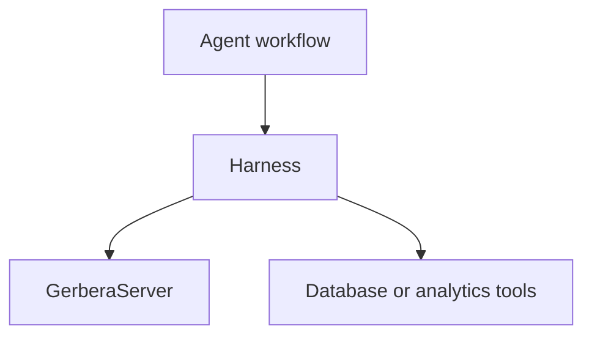

# Harness

The harness folder is reserved for future agent-harness orchestration code.

At the moment, runtime behavior lives in:

- `server/` for MCP and serial command runtime
- `events/` for event routing and buffering
- `models/` for hardware and database declarations

## Ownership

Future harness code may own:

- higher-level orchestration around hardware systems
- agent-facing workflows
- coordinated runtime procedures

It should not own:

- device builder implementations
- low-level serial parsing
- database write queues

## Flow Placeholder

