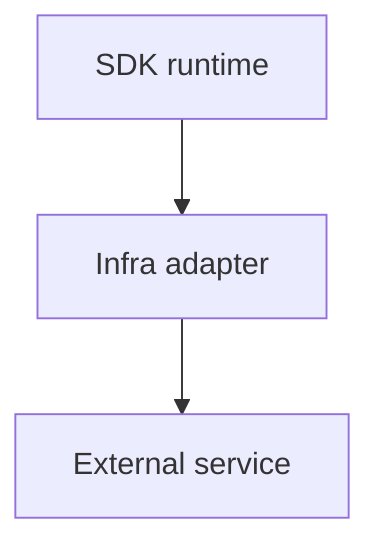

# Infrastructure

The infra folder is reserved for infrastructure adapters.

Current concrete runtime infrastructure lives elsewhere:

- serial runtime in `server/serial_connection.py`
- database connection model in `models/database.py`
- event write worker in `events/event_worker.py`

## Ownership

Future infra adapters may own:

- cloud database provisioning wrappers
- external queue adapters
- deployment/tunnel adapters
- managed service integrations

They should not own:

- hardware model structure
- firmware generation
- MCP tool registration
- event domain logic

## Flow Placeholder

