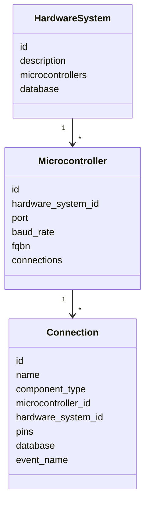

# Models

The models folder owns the hardware declaration graph and database connection model.

Models define relationships and identity. They should stay close to data and validation.

## Files

```text
hardware_system.py      Top-level system with microcontrollers.
microcontroller.py      Board identity, port, fqbn, connections.
connection.py           One callable hardware capability.
database.py             PostgreSQL connection details and table helpers.
table.py                In-memory table metadata.
pin.py                  Pin model support.
```

## Ownership

This folder owns:

- hardware hierarchy
- IDs and parent relationships
- connection identity and stable `event_name`
- explicit database attachment per connection
- schema/table creation helpers

This folder does not own:

- MCP server lifecycle
- serial reads/writes
- firmware routing code
- event listener threads

## Domain Graph



## Connection Identity

`Connection.event_name` is the internal name used for:

- MCP event routing
- STREAM event routing
- database table name
- generated firmware serial output

Format:

```text
<component_type>_<short_microcontroller_hash>_<short_connection_hash>
```

Use `description` for human readability. Do not depend on descriptions or long connection names for storage identity.

## Database Rule

Database attachment is explicit per connection.

Do not propagate a database to every connection automatically. Only database-compatible device builders should accept database-backed streaming.
