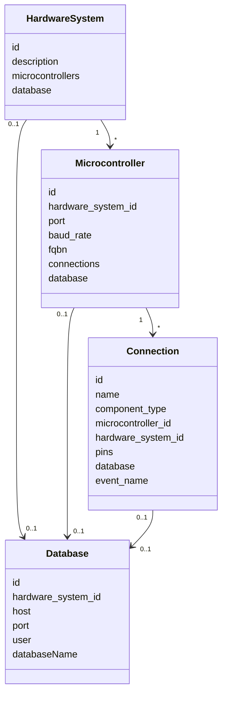

# Models

READ: we will need to clean up the code for this modelling. It is messy right now and does not fully reflect the intended user experience yet. THE SOURCE OF TRUTH FOR MICROCONTROLLERS IS `config.json["devices"]`.

The models folder owns the hardware declaration graph and the database model used by the runtime.

Models should stay focused on:

- relationships
- identity
- validation
- database metadata

## Files

```text
hardware_system.py      Top-level hardware declaration.
microcontroller.py      Board identity resolved from config.json via port.
connection.py           One declared device connection on a board.
database.py             PostgreSQL connection details and table metadata.
table.py                In-memory table metadata.
pin.py                  Pin model support.
```

## Ownership

This folder owns:

- hardware hierarchy
- parent-child relationships
- stable board and connection identity
- connection event naming
- database attachment metadata
- database attachment and table metadata

This folder does not own:

- server lifecycle
- serial transport
- firmware execution
- event listener threads
- MCP transport wiring

## Domain Graph



## Identity Rules

`HardwareSystem.id`

- identifies the top-level declared system

`Microcontroller.id`

- is resolved from `config.json["devices"]`
- is not intended to be user-defined directly
- is currently derived by matching the declared `port`

`Connection.microcontroller_id`

- must match the owning microcontroller
- is filled during connection registration if omitted

## Connection Event Name

`Connection.event_name` is the internal identifier used for:

- MCP event routing
- STREAM event routing
- stream table naming
- firmware event output naming

Current format:

```text
<component_type>_<short_microcontroller_hash>_<short_pin_hash>
```

How it is built:

- `component_type` is kept readable
- the owning microcontroller `id` is hashed down to a short stable suffix
- `pins` are canonicalized into a stable signature such as `echo=8,trigger=9`
- that pin signature is hashed down to a short suffix

Why pins are included:

- `component_type + microcontroller_id` is not enough when the same board has two devices of the same type
- adding the pin signature distinguishes physical attachments without relying on mutable fields like `name`

This is intentionally short to avoid PostgreSQL identifier length issues. It is internal identity, not a user-facing label.

Use `name` and `description` for readability.

## Database Rules

Database support is device-specific.

- Not every connection should receive a database.
- `DatabaseRuntime` creates stream tables only for database-compatible builders.
- A hardware system can define one database at the top level.
- That database may be propagated downward only when the device builder supports database streaming.

This area is still in flux and should be simplified later.
