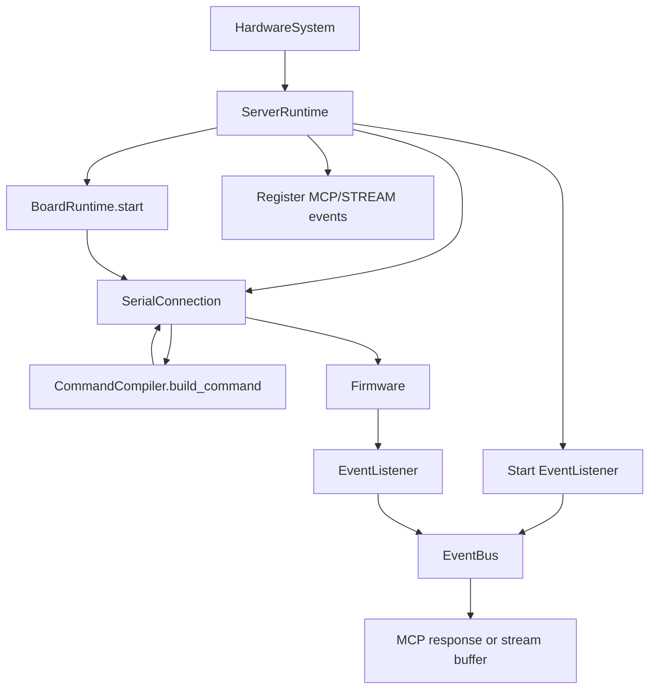

# Runtime

The runtime folder owns the live server process around the declared hardware graph.

It is responsible for:

- opening and closing serial connections
- registering MCP tools
- translating command specs into wire commands
- registering MCP and STREAM events
- starting and stopping listener threads
- coordinating stream flushing and database writes

It is not responsible for:

- defining the hardware graph itself
- device-specific firmware behavior
- pin modeling
- board/package metadata for compilation

## Files

```text
server.py               Thin facade over ServerRuntime.
server_runtime.py       Top-level runtime orchestrator.
board_runtime.py        Per-process board transport pool and lifecycle.
command_runtime.py      Command compilation and response parsing.
commands.py             Compatibility shim for CommandCompiler import path.
```

## Ownership

`ServerRuntime` owns:

- startup and shutdown order
- MCP app/tool registration
- event registration
- event listener lifecycle
- event worker startup
- binding executable actions onto connections
- command dispatch through board transport

`BoardRuntime` owns:

- opening one serial connection per microcontroller
- looking up the active serial connection for a board
- closing active serial connections

`CommandCompiler` owns:

- reading command specs from device builders
- validating and serializing command parameters
- parsing firmware response payloads
- building command descriptions for MCP tools

## Runtime Flow



## Boundary Rule

The runtime layer should know how the system runs.

The hardware layer should only know what the system is.

If a class needs to start threads, open ports, register MCP tools, or configure the event worker, it belongs in runtime rather than hardware.
