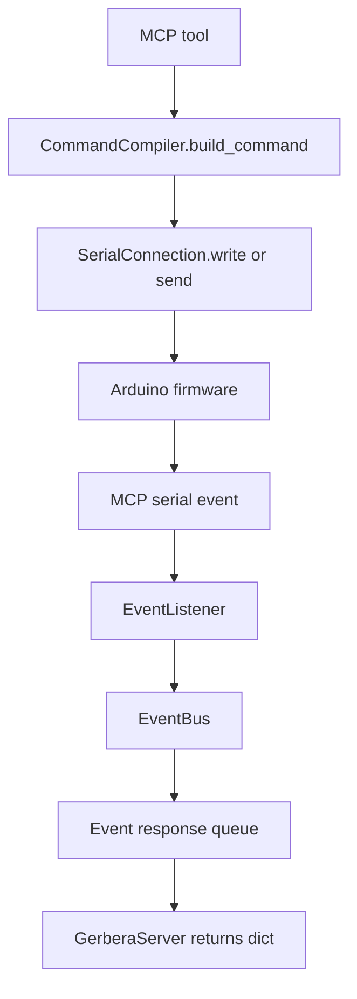
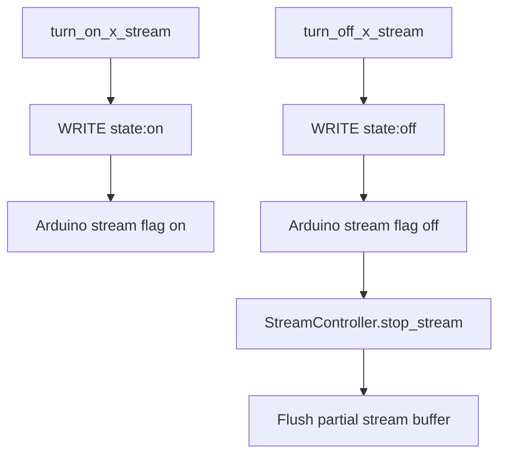

# Server

The server folder owns the runtime MCP server, serial command execution, tool registration, and response waiting.

## Files

```text
server.py               GerberaServer runtime orchestration.
commands.py             CommandCompiler for command strings and response parsing.
serial_connection.py    Serial port wrapper.
```

## Ownership

This folder owns:

- registering MCP tools from connection command specs
- opening one serial connection per microcontroller
- sending command strings to firmware
- waiting for MCP event responses
- starting/stopping event listeners
- delegating stream lifecycle cleanup to `StreamController`

This folder does not own:

- device-specific firmware logic
- database schema design
- buffer internals
- stream event parsing

## Tool Call Flow



## Stream Toggle Flow



## Rule

`GerberaServer` should orchestrate. It should not know how buffers work internally.
