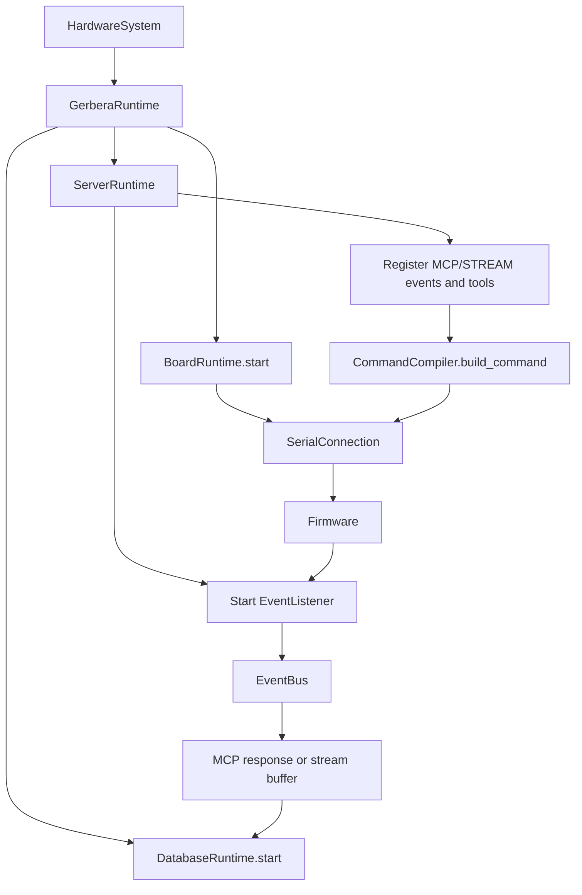

# Runtime

The runtime folder owns the live server process around the declared hardware graph.

It is responsible for:

- opening and closing serial connections
- registering MCP tools
- translating command specs into wire commands
- registering MCP and STREAM events
- starting and stopping listener threads
- coordinating stream flushing and database writes

It is not responsible for:

- defining the hardware graph itself
- device-specific firmware behavior
- pin modeling
- board/package metadata for compilation

## Files

```text
server_runtime.py       MCP tools, events, listeners, and command dispatch.
board_runtime.py        Per-process board transport pool and lifecycle.
database_runtime.py     Database table provisioning and write lifecycle.
command_runtime.py      Command compilation and response parsing.
```

## Ownership

`GerberaRuntime` owns:

- startup and shutdown order
- constructing one event worker and injecting it into database and server runtimes

`ServerRuntime` owns:

- MCP app/tool registration
- event registration
- event listener lifecycle
- binding executable actions onto connections
- command dispatch through board transport

`BoardRuntime` owns:

- opening one serial connection per microcontroller
- looking up the active serial connection for a board
- closing active serial connections

`DatabaseRuntime` owns:

- validating database-capable connections
- creating stream tables and indexes
- routing table writes to the correct database
- starting, flushing, and stopping the database write worker

`CommandCompiler` owns:

- reading command specs from device builders
- validating and serializing command parameters
- parsing firmware response payloads
- building command descriptions for MCP tools

## Runtime Flow



## Boundary Rule

The runtime layer should know how the system runs.

The hardware layer should only know what the system is.

If a class needs to start threads, open ports, register MCP tools, create tables, or configure the event worker, it belongs in runtime rather than hardware.
